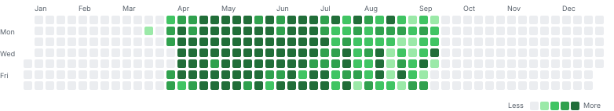

# 🌱 코테 잔디 — 전체 기록 (2026)

> 총 **818문제** · 활동 **148일** · 최장 연속 **144일**
> 🖱️ 마우스 hover로 보려면 **`assets/heatmap.html`** 을 브라우저로 열 것

---

<b>2026-08</b> — 24일 / 64문제

| 날짜 | 문제 |
|---|---|
| **08-24** (월) | SWEA 25000 마라톤 코스 (못품) |
| **08-23** (일) | SWEA 27183 고속선 선로 피로도 관제 시스템 D6 (못품) BOJ 25757 임스와 함께하는 미니게임 (품) |
| **08-22** (토) | BOJ 20125 쿠키의 신체 측정 (품) SWEA 27172 태양광 발전 단지 관제 시스템 D6 (시간초과) |
| **08-21** (금) | SWEA 24997 택시 호출 서비스 (품) |
| **08-20** (목) | SWEA 24995 온라인마트 (못품) |
| **08-19** (수) | SWEA 24703 어항물채우기 정답 (시간초과) |
| **08-18** (화) | SWEA 27185 등산로 급수대 운영 시스템 D6 (못품) BOJ 17143 낚시왕 (품) |
| **08-17** (월) | SWEA 27183 고속선 선로 피로도 관제 시스템 D6 (못품) BOJ 15662 톱니바퀴 (2) (품) BOJ 17070 파이프 옮기기 1 (못품) |
| **08-16** (일) | SWEA 27181 공항 활주로 관제 시스템 D6 (품) BOJ 2559 수열 (틀림) BOJ 2941 크로아티아 알파벳 (품) BOJ 2566 풀이일 : 2026-08-16   결과: 품 (품) BOJ 9086 풀이일 : 2026-08-16   결과: 품 (품) BOJ 17140 이차원 배열과 연산 (품) BOJ 1912 연속합 (못품) |
| **08-15** (토) | BOJ 1100 하얀 칸 (품) BOJ 20057 마법사 상어와 토네이도 (품) |
| **08-14** (금) | SWEA 10726 이진수 표현 D3 (품) SWEA 1873 상호의 배틀필드 D3 (품) SWEA 1247 [S/W 문제해결 응용] 3일차 - 최적 경로 D5 (품) SWEA 1248 [S/W 문제해결 응용] 3일차 - 공통조상 D5 (품) SWEA 27172 태양광 발전 단지 관제 시스템 D6 (시간초과) |
| **08-13** (목) | SWEA 2105 [모의 SW 역량테스트] 디저트 카페 (품) SWEA 1953 [모의 SW 역량테스트] 탈주범 검거 (품) SWEA 1952 [모의 SW 역량테스트] 수영장 (품) SWEA 1949 [모의 SW 역량테스트] 등산로 조성 (품) SWEA 1288 새로운 불면증 치료법 D2 (품) |
| **08-12** (수) | SWEA 2115 [모의 SW 역량테스트] 벌꿀채취 (품) SWEA 2112 [모의 SW 역량테스트] 보호 필름 (품) BOJ 10822 더하기 (품) BOJ 14891  (품) BOJ 11655 ROT13 (품) BOJ 10809 알파벳 찾기 (품) BOJ 15686 치킨 배달 (품) |
| **08-11** (화) | SWEA 2382 미생물 격리 (품) SWEA 2117 홈 방범 서비스 (품) |
| **08-10** (월) | BOJ 2636  (품) SWEA 2477 차량 정비소 (품) SWEA 2383 점심 식사시간 (품) |
| **08-09** (일) | SWEA 4128 요리사 (품) SWEA 4123 숫자 만들기 (품) |
| **08-08** (토) | SWEA 4613 러시아 국기 같은 깃발 (품) SWEA 4013 특이한 자석 (품) BOJ 14891 톱니바퀴 (품) |
| **08-07** (금) | SWEA 5653 줄기세포배양 (품) SWEA 4131 활주로 건설 (품) |
| **08-06** (목) | SWEA 6190 정곤이의 단조 증가하는 수 (품) SWEA 5644 무선 충전 (품) |
| **08-05** (수) | BOJ 17837  (틀림) BOJ 1344  (품) SWEA 5648 원자 소멸 시뮬레이션 (못품) |
| **08-04** (화) | BOJ 1269  (품) SWEA 5650 핀볼 게임 (품) |
| **08-03** (월) | BOJ 1561 놀이공원 (품) SWEA 5653 줄기세포배양 (못품) |
| **08-02** (일) | BOJ 1644  (품) BOJ 2293  (맞음) BOJ 1344  (못품) |
| **08-01** (토) | SWEA 5656 벽돌 깨기 (품) |

<b>2026-07</b> — 31일 / 101문제

| 날짜 | 문제 |
|---|---|
| **07-31** (금) | BOJ 1285  (품) BOJ 1561 놀이공원 (못품) SWEA 5658 보물상자 비밀번호 (품) |
| **07-30** (목) | BOJ 2293  (틀림) SWEA 26070 보석 수집 로봇 (품) |
| **07-29** (수) | BOJ 1644  (틀림) SWEA 26071 블록 제거 게임 (품) |
| **07-28** (화) | BOJ 1285  (못품) SWEA 1767 프로세서 연결하기 (시간초과) |
| **07-27** (월) | BOJ 2293  (못품) SWEA 6190 정곤이의 단조 증가하는 수 (틀림) SWEA 4613 러시아 국기 같은 깃발 (못품) |
| **07-26** (일) | BOJ 3197  (품) BOJ 2805 농작물 수확하기 (품) SWEA 14555 공과 잡초 (품) SWEA 3499 퍼펙트 셔플 (품) |
| **07-25** (토) | BOJ 1285  (시간초과) BOJ 2098  (품) SWEA 10761 신뢰 (품) SWEA 11315 오목 판정 (품) SWEA 1289 원재의 메모리 복구하기 (품) |
| **07-24** (금) | BOJ 5373  (못품) SWEA 26045 부분 수열 판별 (품) SWEA 26059 과일 등급 분류 (품) |
| **07-23** (목) | BOJ 3197  (시간초과) SWEA 1979 어디에 단어가 들어갈 수 있을까 (품) SWEA 20230 풍선팡 보너스게임2 (품) SWEA 25052 등산로 (품) SWEA 25985 숫자열의 최대 곱 (품) |
| **07-22** (수) | BOJ 1285  (못품) BOJ 3015  (품) SWEA 8702 당근 수확 (품) SWEA 10760 우주선착륙2 (품) SWEA 12712 파리퇴치3 (품) SWEA 1926 간단한 369게임 (품) |
| **07-21** (화) | SWEA 21936  (품) SWEA 22375  (품) SWEA 23795 우주 괴물 (품) |
| **07-20** (월) | BOJ 12869  (품) BOJ 3197  (못품) |
| **07-19** (일) | BOJ 3015  (못품) BOJ 2618  (품) |
| **07-18** (토) | BOJ 14499  (품) BOJ 16637  (품) |
| **07-17** (금) | BOJ 1629  (품) BOJ 4179  (품) |
| **07-16** (목) | BOJ 16637  (틀림) BOJ 3015  (못품) BOJ 2618  (못품) |
| **07-15** (수) | BOJ 15684  (품) BOJ 12851  (품) BOJ 15683 감시 (품) |
| **07-14** (화) | BOJ 16637  (못품) BOJ 1103  (품) |
| **07-13** (월) | BOJ 2618  (못품) BOJ 외벽점검 (품) |
| **07-12** (일) | BOJ 15684  (틀림) BOJ 12851  (틀림) BOJ 3015  (못품) BOJ 15683 감시 (틀림) BOJ 5373  (못품) |
| **07-11** (토) | BOJ 14890  (품) BOJ 1062  (품) BOJ 1781  (품) BOJ 1103  (못품) |
| **07-10** (금) | BOJ 2309  (맞음) BOJ 1062  (틀림) BOJ 11718  (맞음) BOJ 외벽점검 (못품) |
| **07-09** (목) | BOJ 2234  (품) BOJ 3015  (못품) BOJ 5373  (못품) |
| **07-08** (수) | BOJ 15353  (맞음) BOJ 15926  (맞음) BOJ 1103  (틀림) |
| **07-07** (화) | BOJ 1062  (틀림) BOJ 1931  (맞음) BOJ 11718  (틀림) BOJ 1193  (품) BOJ 15972  (맞음) |
| **07-06** (월) | BOJ 1285  (못품) BOJ 2234  (못품) BOJ 5373  (못품) |
| **07-05** (일) | BOJ 15353  (틀림) BOJ 15926  (못품) BOJ 1103  (못품) |
| **07-04** (토) | BOJ 1062  (시간초과) BOJ 14391  (맞음) BOJ 11718  (못품) BOJ 15972  (틀림) |
| **07-03** (금) | BOJ 11723  (품) BOJ 5430  (품) BOJ 2109  (품) BOJ 5373  (못품) |
| **07-02** (목) | BOJ 해적선장 코디 못품. (시간초과) BOJ 15353  (틀림) BOJ 15926  (못품) |
| **07-01** (수) | BOJ 17071  (품) BOJ 14391  (틀림) BOJ 1280  (품) BOJ 15972  (못품) |

<b>2026-06</b> — 30일 / 158문제

| 날짜 | 문제 |
|---|---|
| **06-30** (화) | BOJ 13244  (맞음) BOJ 5430  (시간초과) BOJ 2109  (틀림) BOJ 1480  (품) BOJ 5373  (못품) BOJ 메두사와 전사들 (못품) |
| **06-29** (월) | BOJ 고대 문명 유적 탐사 (못품) BOJ 12869  (틀림) BOJ 13913  (맞음) BOJ 1644  (시간초과) |
| **06-28** (일) | BOJ 해적선장 코디 못품. (시간초과) BOJ 17071  (못품) BOJ 14391  (못품) BOJ 10798  (맞음) BOJ 17297  (품) BOJ 1280  (못품) BOJ 15972  (못품) |
| **06-27** (토) | BOJ 9996  (맞음) BOJ 택배 하차 (못품) BOJ 1480  (못품) BOJ 1219  (맞음) BOJ 5373  (못품) BOJ 15972  (못품) |
| **06-26** (금) | BOJ 외벽점검 (못품) |
| **06-25** (목) | BOJ 17071  (못품) BOJ 17297  (못품) BOJ 11658  (품) BOJ 코드트리 메신저 (틀림) |
| **06-24** (수) | BOJ 아기 고래의 첫 항해 (품) BOJ 16118  (품) BOJ 1219  (틀림) BOJ 17616  (품) |
| **06-23** (화) | BOJ 9996  (틀림) BOJ 1280  (못품) BOJ 15972  (못품) BOJ 코드트리 등산 게임 (품) |
| **06-22** (월) | BOJ 1992  (품) BOJ 17297  (틀림) BOJ 11658  (틀림) BOJ 코드트리 나무박멸 (틀림) |
| **06-21** (일) | BOJ 4179  (틀림) BOJ 3197  (틀림) BOJ 2098  (못품) BOJ 1480  (못품) BOJ 17623  (못품) BOJ 3653  (못품) BOJ 코드트리 미지의 공간 탈출 (못품) |
| **06-20** (토) | BOJ 16118  (틀림) BOJ 1219  (못품) BOJ 5373  (못품) BOJ 14864  (품) BOJ 17616  (틀림) BOJ 코드트리 투어 (품) |
| **06-19** (금) | BOJ 1486  (품) BOJ 15972  (못품) BOJ 자물쇠와 열쇠 (품) |
| **06-18** (목) | BOJ 1480  (못품) BOJ 17297  (틀림) BOJ 17611  (품) BOJ 코드 트리 개구리의 여행 (못품) |
| **06-17** (수) | BOJ 9996  (틀림) BOJ 1992  (틀림) BOJ 13248  (못품) BOJ 2098  (틀림) BOJ 11658  (틀림) BOJ 5719  (품) BOJ 9370  (품) BOJ 코드트리 등산 게임 (못품) |
| **06-16** (화) | BOJ 3197  (시간초과) BOJ 1280  (못품) BOJ 2042  (품) BOJ 5719  (틀림) BOJ 1238  (품) BOJ 17612  (품) BOJ 루돌프의 반란 (틀림) |
| **06-15** (월) | BOJ 1480  (못품) BOJ 17297  (못품) BOJ 1219  (틀림) BOJ 17611  (못품) BOJ 코디의 향수 공방 (못품) |
| **06-14** (일) | BOJ 13248  (못품) BOJ 2098  (못품) BOJ 11658  (틀림) BOJ 가로등 설치 (못품) |
| **06-13** (토) | BOJ 17623  (못품) BOJ 5719  (틀림) BOJ 16118  (못품) BOJ 14864  (못품) BOJ 외벽점검 (못품) |
| **06-12** (금) | BOJ 9370  (틀림) BOJ 17612  (못품) BOJ 아기 바다거북의 대모험: 해저 화산 지대 (품) |
| **06-11** (목) | BOJ 2342  (품) BOJ 1280  (못품) BOJ 3653  (못품) BOJ 2042  (틀림) BOJ 1219  (못품) BOJ 1238  (못품) BOJ 코디의 향수 공방 (틀림) |
| **06-10** (수) | BOJ 1620  (품) BOJ 17297  (못품) BOJ 11658  (틀림) BOJ 5719  (못품) BOJ 17616  (틀림) |
| **06-09** (화) | BOJ 2468  (품) BOJ 2098  (못품) BOJ 1480  (못품) BOJ 17623  (못품) BOJ 1486  (못품) BOJ 5373  (못품) BOJ 14864  (못품) BOJ 15972  (못품) |
| **06-08** (월) | BOJ 9370  (못품) BOJ 17612  (못품) BOJ 4485  (품) |
| **06-07** (일) | BOJ 16118  (못품) BOJ 1219  (못품) BOJ 1238  (못품) |
| **06-06** (토) | BOJ 1486  (틀림) BOJ 5719  (못품) |
| **06-05** (금) | BOJ 3653  (못품) BOJ 2042  (못품) BOJ 11658  (못품) |
| **06-04** (목) | BOJ 6236 용돈 관리 (맞음) BOJ 2098  (못품) BOJ 2342  (틀림) BOJ 1480  (못품) BOJ 17623  (못품) BOJ 17297  (못품) BOJ 1280  (못품) |
| **06-03** (수) | BOJ 4375  (품) BOJ 13248  (못품) BOJ 14501  (품) BOJ 17136  (틀림) BOJ 10942  (품) BOJ 14863  (틀림) BOJ 5419  (못품) BOJ 2302  (틀림) BOJ 1514  (못품) |
| **06-02** (화) | BOJ 2293  (틀림) BOJ 1344  (틀림) BOJ 2618  (못품) BOJ 1315  (못품) BOJ 17285  (못품) BOJ 17258  (못품) |
| **06-01** (월) | BOJ 6236 용돈 관리 (틀림) BOJ 2565 전깃줄 (품) BOJ 2098  (틀림) BOJ 2240  (못품) BOJ 4811  (못품) BOJ 2294  (품) BOJ 2342  (못품) BOJ 1480  (못품) |

<b>2026-05</b> — 31일 / 295문제

| 날짜 | 문제 |
|---|---|
| **05-31** (일) | BOJ 4375  (못품) BOJ 1992  (못품) BOJ 14501  (틀림) BOJ 10942  (못품) BOJ 1509  (못품) BOJ 5557  (맞음) BOJ 1450  (틀림) BOJ 14863  (못품) |
| **05-30** (토) | BOJ 14003  (틀림) BOJ 11053  (품) BOJ 17837  (틀림) BOJ 14876  (틀림) BOJ 1344  (못품) |
| **05-29** (금) | BOJ 1068  (맞음) BOJ 13248  (못품) BOJ 16637  (못품) BOJ 2632  (못품) BOJ 14627  (틀림) BOJ 1535  (맞음) BOJ 16235  (시간초과) BOJ 17136  (틀림) |
| **05-28** (목) | BOJ 4375  (틀림) BOJ 17825  (못품) BOJ 15685  (못품) BOJ 12865  (품) BOJ 2240  (못품) BOJ 4811  (못품) BOJ 12852  (맞음) BOJ 2294  (틀림) BOJ 2293  (틀림) |
| **05-27** (수) | BOJ 1629  (틀림) BOJ 1992  (못품) BOJ 3474  (못품) BOJ 14501  (품) BOJ 2170  (틀림) BOJ 16434  (맞음) BOJ 1072  (품) BOJ 14003  (못품) BOJ 2670  (못품) BOJ 11053  (못품) BOJ 14002  (못품) BOJ 2098  (못품) |
| **05-26** (화) | BOJ 1068  (틀림) BOJ 14499  (틀림) BOJ 4179  (틀림) BOJ 16637  (못품) BOJ 홀짝트리 (품) BOJ 2170  (틀림) BOJ 16434  (틀림) BOJ 1072  (틀림) BOJ 2776  BOJ 14627  (틀림) |
| **05-25** (월) | BOJ 홀짝트리 (틀림) BOJ 2026 -05-17 (품) BOJ 6236 용돈 관리 (틀림) BOJ 2565 전깃줄 (못품) BOJ 5215 햄버거 다이어트 (못품) BOJ 17825  (못품) BOJ 15685  (못품) BOJ 2632  (못품) BOJ 17822  (틀림) BOJ 12865  (품) |
| **05-24** (일) | BOJ 17825  (못품) BOJ 17143  (못품) BOJ 1269  (못품) |
| **05-23** (토) | BOJ 5215 햄버거 다이어트 (품) BOJ 2805 농작물 수확하기 (품) BOJ 1103  (못품) |
| **05-22** (금) | SWEA Flatten SW Expert Academy (품) BOJ 1209 \[S/W 문제해결 기본] 2일차 - Sum (품) BOJ 1213 \[S/W 문제해결 기본] 3일차 - String (품) BOJ 1225 \[S/W 문제해결 기본] 7일차 - 암호생성기 (품) BOJ 싸피 수기 공모집 문제 (틀림) BOJ 1234 \[S/W 문제해결 기본] 10일차 - 비밀번호 (품) BOJ 1860 진기의 최고급 붕어빵 (품) |
| **05-21** (목) | BOJ 귤 고르기 (맞음) SWEA 최대상금 SW Expert Academy (못품) |
| **05-20** (수) | BOJ 12851  (못품) BOJ 1931  (틀림) BOJ 충돌 위험 찾기 (틀림) BOJ 2792 보석 상자 (맞음) BOJ 1561 놀이공원 (못품) BOJ 17070 파이프 옮기기1 |
| **05-19** (화) | BOJ 14888  (맞음) BOJ 2529  (품) BOJ 1781  (틀림) BOJ 체육복 (못품) BOJ 17406  (품) |
| **05-18** (월) | BOJ 가장큰수 (못품) BOJ 4 번 제출코드 (품) BOJ 6236 용돈 관리 (틀림) BOJ 2565 전깃줄 (맞음) |
| **05-17** (일) | BOJ 1700  (품) BOJ 모의고사 1회 4번 (못품) BOJ 15683 감시 (틀림) BOJ 2792 보석 상자 (틀림) BOJ 6236 용돈 관리 (틀림) BOJ 1911 흙길 보수하기 (맞음) BOJ 2565 전깃줄 (틀림) BOJ 15662 톱니바퀴 (틀림) |
| **05-16** (토) | BOJ 7795 먹을 것인가 먹힐 것인가 (품) BOJ 1912 연속합 (못품) BOJ 14469  (품) BOJ 17406  (못품) |
| **05-15** (금) | BOJ 1931  (틀림) BOJ 1644  (못품) BOJ 조이스틱 (품) BOJ 15683 감시 (못품) BOJ 2792 보석 상자 (못품) |
| **05-14** (목) | BOJ 9996  (틀림) BOJ 14497  (품) BOJ 1700  (못품) BOJ 모의고사 1회 3번 (틀림) BOJ 4 번 제출코드 (못품) |
| **05-13** (수) | BOJ 9935  (맞음) BOJ 인사고과 (맞음) |
| **05-12** (화) | BOJ 2870  (품) BOJ 3015  (못품) BOJ 9935  (틀림) BOJ 조이스틱 (틀림) BOJ 3 번 제출코드 (품) |
| **05-11** (월) | BOJ 1325  (품) BOJ 9935  (틀림) BOJ 1700  (못품) BOJ 디스크 컨트롤러 (품) BOJ 1 번 제출코드 (맞음) BOJ 2 번 제출코드 (맞음) BOJ 3 번 제출코드 (틀림) BOJ 4 번 제출코드 (틀림) BOJ 2343 기타레슨 (품) |
| **05-10** (일) | BOJ 디스크 컨트롤러 (틀림) |
| **05-09** (토) | BOJ 17140  (틀림) BOJ 2529  (못품) BOJ 충돌 위험 찾기 (틀림) |
| **05-08** (금) | BOJ 2910  (품) BOJ 게임 맵 최단거리 (틀림) |
| **05-07** (목) | BOJ 프로그래머스 베스트앨범 (품) |
| **05-06** (수) | BOJ 9935  (틀림) BOJ 1700  (못품) BOJ 1463  (품) BOJ 큰수 만들기 (못품) |
| **05-05** (화) | BOJ 1012  (품) BOJ 2910  (못품) BOJ 17298  (품) BOJ 1463  (못품) BOJ 피로도 (틀림) |
| **05-04** (월) | BOJ 프로그래머스 입국심사 (못품) BOJ 1463  (틀림) |
| **05-03** (일) | BOJ 여왕개미 (못품) |
| **05-02** (토) | BOJ 여왕개미 (품) |
| **05-01** (금) | BOJ 1202  (품) BOJ 프로그래머스 타겟 넘버 (못품) |

<b>2026-04</b> — 28일 / 191문제

| 날짜 | 문제 |
|---|---|
| **04-30** (목) | BOJ 출퇴근길 (품) |
| **04-29** (수) | BOJ 15684  (틀림) BOJ 여왕개미 (못품) BOJ 14889  (품) BOJ 19942  (품) BOJ 17471  (품) |
| **04-28** (화) | BOJ 13248  (못품) BOJ 1987  (품) BOJ 19942  (못품) BOJ 9935  (못품) BOJ 1202  (틀림) BOJ 13144  (품) BOJ 교차로 (품) BOJ 1085  (품) |
| **04-27** (월) | BOJ 2309  (틀림) BOJ 11655  (못품) BOJ 여왕개미 (못품) BOJ 14890  (못품) BOJ 9935  (못품) BOJ 1202  (못품) BOJ 1644  (못품) BOJ 27323  (품) |
| **04-26** (일) | BOJ 19942  (못품) BOJ 17471  (못품) BOJ 13144  (못품) BOJ 11653  (품) BOJ 로봇이 지나간 경로 (품) |
| **04-25** (토) | BOJ 1987  (못품) BOJ 19942  (못품) BOJ 17471  (못품) BOJ 13144  (못품) BOJ 2581  (품) BOJ 퇴근 버스 (못품) |
| **04-24** (금) | BOJ 1012  (못품) BOJ 1325  (못품) BOJ 1285  (못품) BOJ 1062  (못품) BOJ 1094  (품) BOJ 1202  (못품) BOJ 1644  (못품) BOJ 2903  (품) BOJ 1193  (못품) BOJ 성적 평가 (못품) BOJ 9506  (품) |
| **04-23** (목) | BOJ 자동차 테스트 (못품) BOJ 5086  (품) |
| **04-22** (수) | BOJ 2559  (못품) BOJ 2636  (못품) BOJ 15686  (못품) BOJ 11723  (못품) BOJ 3273  (품) BOJ 9086  (못품) BOJ 10809  (못품) BOJ 2941  (못품) BOJ 2566  (못품) BOJ 2869  (품) |
| **04-21** (화) | BOJ 1202  (못품) BOJ 1644  (못품) BOJ 13144  (못품) BOJ 아기 고래의 첫 항해 (못품) BOJ 2941  (품) BOJ 25206  (품) BOJ 2720  (품) BOJ 2903  (못품) BOJ 1193  (못품) |
| **04-20** (월) | BOJ 1285  (못품) BOJ 17471  (틀림) BOJ 14890  (못품) BOJ 1062  (못품) BOJ 1094  (못품) BOJ 2234  (틀림) BOJ 9935  (못품) BOJ 2563  (품) BOJ 2745  (품) BOJ 11005  (품) |
| **04-19** (일) | BOJ 1987  (틀림) BOJ 2529  (못품) BOJ 19942  (못품) BOJ 1316  (품) BOJ 25206  (못품) BOJ 10798  (틀림) |
| **04-18** (토) | BOJ 2444  (품) BOJ 2941  (못품) BOJ 2566  (품) |
| **04-17** (금) | BOJ 16637  (못품) BOJ 12851  (못품) BOJ 13913  (못품) BOJ 2908  (품) BOJ 5622  (품) BOJ 11718  (못품) |
| **04-16** (목) | BOJ 14889  (품) BOJ 4179  (못품) BOJ 12869  (못품) BOJ 27866  (품) BOJ 9086  (품) BOJ 10809  (품) |
| **04-15** (수) | BOJ 해적선장 코디 못품. (못품) BOJ 14501  (못품) BOJ 13144  (못품) BOJ 3273  (틀림) BOJ 1700  (못품) |
| **04-14** (화) | BOJ 14891  (못품) BOJ 3190  (품) BOJ 15684  (못품) BOJ 14499  (못품) BOJ 14888  (못품) BOJ 14469  (품) BOJ 1931  BOJ 1202  BOJ 1644  (못품) |
| **04-13** (월) | BOJ 2109  (못품) BOJ 9935  (못품) BOJ 1781  (품) |
| **04-12** (일) | BOJ 15686  (품) BOJ 2589  (품) BOJ 16234  (품) |
| **04-11** (토) | BOJ 15926  (못품) BOJ 3015  (못품) |
| **04-10** (금) | BOJ 10709  (품) BOJ 3474  (못품) BOJ 1436  (품) BOJ 4949  (품) BOJ 14502  (품) BOJ 1068  (못품) BOJ 1325  (못품) BOJ 17298  (못품) BOJ 17471  (못품) BOJ 13244  (틀림) BOJ 5430  (틀림) BOJ 14405  (품) BOJ 15353  (틀림) |
| **04-09** (목) | BOJ 1012  (못품) BOJ 1992  (못품) BOJ 2910  (못품) BOJ 4659  (품) BOJ 2870  (못품) BOJ 14889  (못품) BOJ 4179  (못품) BOJ 17071  (못품) BOJ 11723  (못품) BOJ 14391  (못품) |
| **04-08** (수) | BOJ 3986  (품) BOJ 1629  (못품) BOJ 4375  (못품) BOJ 10828  (품) BOJ 2468  (틀림) BOJ 14890  (못품) BOJ 1062  (못품) BOJ 1094  (못품) BOJ 2234  (못품) |
| **04-07** (화) | BOJ 9996  (틀림) BOJ 2559  (품) BOJ 1620  (못품) BOJ 14620  (품) BOJ 19942  (틀림) BOJ 1285  (못품) BOJ 17471  (못품) |
| **04-06** (월) | BOJ 10808  (품) BOJ 10988  (품) BOJ 1159  (품) BOJ 11655  (못품) BOJ 15684  (틀림) BOJ 2529  (못품) BOJ 2309  (틀림) |
| **04-05** (일) | BOJ 17071  (못품) BOJ 3197  (못품) BOJ 1987  (못품) |
| **04-04** (토) | BOJ 12851  (못품) BOJ 13913  (못품) BOJ 14497  (못품) |
| **04-03** (금) | BOJ 4179  (못품) BOJ 12869  (못품) BOJ 16637  (못품) |

<b>2026-03</b> — 4일 / 9문제

| 날짜 | 문제 |
|---|---|
| **03-31** (화) | BOJ 14889  (못품) BOJ 고대 문명 유적 탐사 (못품) |
| **03-30** (월) | BOJ 여왕개미 (못품) BOJ 14889  (못품) |
| **03-29** (일) | BOJ 택배 하차 (못품) |
| **03-16** (월) | BOJ 2309  |

