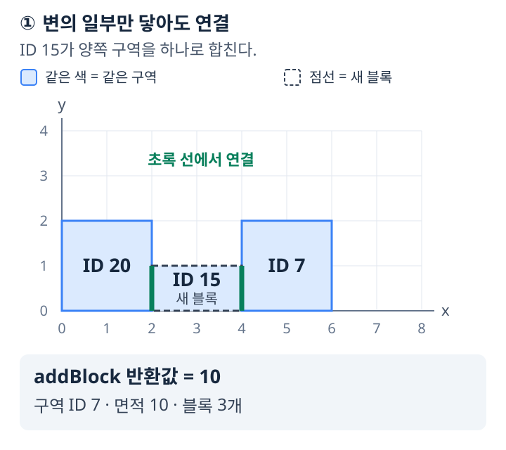
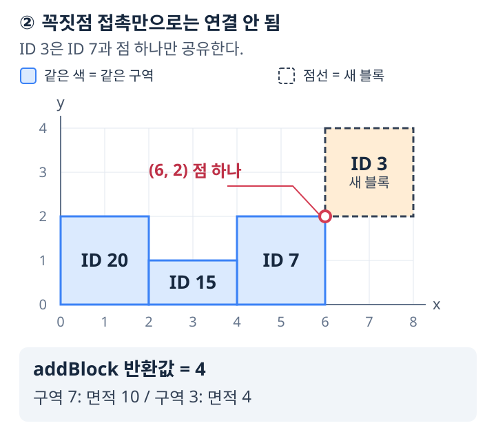
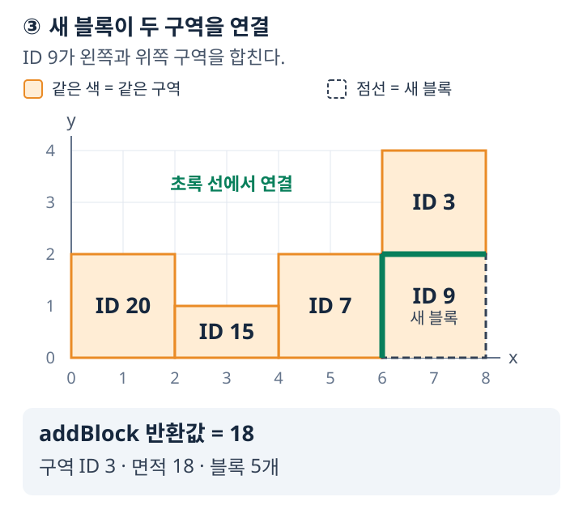

# 블록 구역 관리 — 삼성 B형 문제 복원

대화에서 기억해 낸 내용을 정리한 **연습용 복원본**이다. 문제 제목, 일부 함수 이름,
`Result` 필드 이름, 채점기의 명령 형식은 복원을 위해 정했다. 원문이나 공식 예제가 아니다.
`solution.py`에는 직접 구현할 함수 틀만 있으며, 정답 풀이와 알고리즘 힌트는 포함하지 않는다.

## 1. 문제 설명

한 변의 길이가 `N`인 정사각형 보드가 있다. 처음에는 보드 위에 블록이 없다.
보드에 직사각형 블록을 하나씩 추가하면서 구역을 관리하려고 한다.

블록은 고유한 ID `blockId`와 두 꼭짓점의 좌표 `(x1, y1)`, `(x2, y2)`로 표현한다.
직사각형의 변은 좌표축과 평행하다. 모든 좌표는 정수이며, 이 복원본의 좌표 범위는 다음과 같다.

```text
0 <= x1 < x2 <= N
0 <= y1 < y2 <= N
블록의 면적 = (x2 - x1) * (y2 - y1)
```

따라서 `(1, 1)`과 `(2, 2)`로 주어진 블록의 면적은 `1`이다.
블록들은 서로 내부가 겹치지 않으며, 경계가 맞닿는 것은 허용한다.
**블록은 랜덤하게 생성된다.** 이는 사용자가 재확인한 입력 조건이다.
구체적인 확률 분포와 블록 크기 상한 식은 아직 복원되지 않았다.
**블록 ID는 추가 순서와 무관하며, 1, 2, 3, ... 순서로 주어진다는 보장이 없다.**

### 구역

두 블록이 **길이가 양수인 선분을 경계에서 공유**하면 같은 구역에 속한다.

- 변 전체가 일치할 필요는 없으며, 변의 일부만 맞닿아도 연결된다.
- 꼭짓점 하나만 맞닿는 블록은 그 접촉만으로는 연결되지 않는다.
- 다른 블록들을 통해 연결되어도 같은 구역이다.
- 다른 블록과 연결되지 않은 블록도 혼자 하나의 구역을 이룬다.
- 새 블록이 여러 구역과 연결되면, 그 구역들과 새 블록이 하나의 구역이 된다.

구역의 **ID는 포함된 블록 ID의 최솟값**이다.
구역의 **면적은 포함된 블록들의 면적 합계**이며, 블록 사이의 빈 공간은 포함하지 않는다.
구역의 **블록 수는 포함된 블록의 개수**이다.
블록을 삭제하거나 이동하는 기능은 없다.

구역 ID는 블록이 추가되어 구역들이 합쳐질 때 바뀔 수 있다. 각 블록의 고유한 ID는 바뀌지 않는다.
예를 들어 ID가 `20, 7, 15`인 블록들이 한 구역이면 구역 ID는 `7`이다.
이 구역이 ID `3`인 블록을 포함한 구역과 합쳐지면 새 구역 ID는 `3`이 된다.
이후에도 블록 `20`, `7`, `15`는 각각의 원래 ID로 조회한다.

### 구역 순위

현재 존재하는 구역을 다음 우선순위로 정렬한다.

1. 구역의 면적이 클수록 우선한다.
2. 면적이 같으면 구역의 블록 수가 적을수록 우선한다.
3. 면적과 블록 수가 모두 같으면 구역 ID가 작을수록 우선한다. **복원본에서 채택한 기준이며 원문은 미확인이다.**

## 2. 구현할 함수

함수들은 `solution.py`의 모듈 수준 함수다. 채점기에서 직접 호출하므로
`solution.py`에서 입력을 읽거나 채점용 출력을 하지 않는다.

| 함수 | 역할 | 반환값 |
| --- | --- | --- |
| `init(N)` | 빈 `N × N` 보드로 초기화 | 없음 |
| `addBlock(blockId, x1, y1, x2, y2)` | 새 블록 추가 및 구역 갱신 | **추가 후 해당 블록이 속한 구역의 전체 면적** |
| `isSameRegion(blockId1, blockId2)` | 두 블록의 현재 구역 비교 | 같으면 `1`, 다르면 `0` |
| `top10()` | 현재 순위가 높은 최대 10개 구역 조회 | 구역 ID들을 담은 `Result` |

`init`은 각 테스트 케이스의 첫 명령으로 한 번 호출되며 이전 케이스의 모든 상태를 초기화한다.
`addBlock`에는 현재 케이스에서 사용하지 않은 양의 정수 ID가 주어진다.
`isSameRegion`에는 이미 추가된 블록 ID만 주어진다. 같은 ID가 두 번 주어지면 `1`이다.
두 인자는 각 블록의 고유한 ID다. 그 블록들이 조회 시점에 속한 구역을 비교한다.
이 초기화 방식과 유효한 ID 입력 보장은 복원본에서 정한 약속이다.

`top10`은 구역마다 ID를 하나씩 반환하며, 조회로 보드나 구역의 상태를 바꾸지 않는다.
구역이 10개 미만이면 존재하는 구역만 반환한다. 구역이 없으면 빈 결과를 반환한다.

```python
class Result:
    def __init__(self, count=0, ids=None):
        self.count = count
        self.ids = [] if ids is None else ids
```

- `count`: 실제 반환하는 구역의 개수. `min(10, 현재 구역 수)`이다.
- `ids`: 순위순으로 나열한 구역 ID 목록. **길이는 정확히 `count`**여야 한다.
- 구역이 있으면 `ids[0]`은 1위 구역의 현재 ID이며, 각 구역은 목록에 한 번만 포함한다.
- 남는 칸을 `0` 등으로 채우지 않는다.
- 구역이 없을 때에는 `Result(count=0, ids=[])`를 반환한다.

예를 들어 반환할 구역 ID가 순서대로 `7, 12, 40`이라면
`Result(count=3, ids=[7, 12, 40])`으로 반환한다.
`count`와 `ids`라는 이름은 복원용 이름이며 원래 필드명은 미확인이다.

## 3. 제약 사항과 복원 상태

| 항목 | 복원한 내용 | 확인 상태 |
| --- | --- | --- |
| 보드 | 한 변의 길이가 `N`인 정사각형 | 사용자 확인 |
| `N` 최댓값 | 45,000 | 사용자 기억 |
| 좌표 의미 | 블록의 두 꼭짓점, 면적은 좌표 차이의 곱 | 사용자 확인 |
| 좌표 범위 | 0부터 `N`까지의 정수 | “그랬던 것 같다”는 기억을 채택 |
| 블록 겹침 | 내부가 겹치지 않음 | 사용자 확인 |
| 연결 | 변의 일부 접촉도 연결, 꼭짓점 접촉만으로는 연결되지 않음 | 사용자 확인 |
| ID 입력 순서 | 순차적이라는 보장 없음 | 사용자 확인 |
| 구역 ID | 포함된 블록 ID의 최솟값 | 사용자 확인 |
| 추가 반환값 | 새 블록이 속한 구역의 전체 면적 | 사용자 확인 |
| 추가 호출 횟수 | 테스트 케이스당 최대 15,000회 | 사용자 기억 |
| 시간 제한 | Python 기준 50개 테스트 케이스에 총 6초 | 사용자 기억 |
| 블록 생성 | **“블록은 랜덤하게 생성된다”**는 조건이 있음 | 사용자 재확인, 구체적 분포 미확인 |
| 삭제 함수 | 없음 | 사용자 확인 |
| 순위 1·2순위 | 면적 내림차순, 블록 수 오름차순 | 사용자 확인 |
| 순위 3순위 | 구역 ID 오름차순 | 확실하지 않은 기억을 채택 |
| `Result` | 최대 10개, 10개 미만이면 해당 개수만 반환 | 사용자 확인 |
| `Result`의 개수 필드 | `count`와 `ids` 사용 | 둘 다 있었던 것으로 기억, 필드명은 복원용 |
| `N` 최솟값 | 1 | 연습용으로 설정, 원문 미확인 |
| 블록 ID | 케이스 내에서 중복되지 않는 양의 정수 | 연습용으로 설정, 원문 범위 미확인 |

**아직 복원되지 않은 제한**은 다음과 같다.

- 블록 하나의 가로·세로 길이에 `N`과 연관된 별도 상한이 있었는지, 있었다면 정확한 식.
- 블록 ID의 최댓값과 두 조회 함수의 호출 횟수 제한.
- 랜덤 생성의 구체적인 분포와 생성 방식.
- 정확한 원래 함수 이름, `Result` 필드 이름과 공식 입력 명령 번호.

연습용 입력은 위에 명시한 좌표 범위 안의 블록을 허용하며 별도의 길이 제한은 두지 않는다.
제공한 예제는 규칙을 확인하기 위해 직접 구성했으며, 원문의 랜덤 생성 분포를 재현한 것이 아니다.
채점기는 6초 시간 제한을 강제로 적용하지 않는다.

## 4. 채점기 입력과 출력

복원용 명령 번호는 다음과 같다. 각 명령은 반드시 한 줄에 작성한다.

```text
T MARK
Q
첫 번째 테스트 케이스의 명령 Q개
Q
두 번째 테스트 케이스의 명령 Q개
...
```

| 명령 | 입력 형식 |
| --- | --- |
| 초기화 | `100 N` |
| 블록 추가 | `200 blockId x1 y1 x2 y2 expectedArea` |
| 같은 구역 확인 | `300 blockId1 blockId2 expected` |
| 상위 구역 조회 | `400 K expectedId1 ... expectedIdK` |

- `T`: 테스트 케이스 수. `MARK`: 각 케이스를 모두 통과했을 때의 점수.
- `Q`: 초기화를 포함한 해당 케이스의 명령 수.
- `expectedArea`: 추가 후 새 블록이 속한 구역의 전체 면적.
- `expected`: 동일 구역 확인의 정답인 `0` 또는 `1`.
- `K`: 현재 구역 수와 10 중 작은 값. 반환할 구역이 없으면 `400 0`으로 쓴다.
- 정답 값들은 `main.py`에서 비교하며 `solution.py`의 함수 인자로 전달하지 않는다.

모든 반환값이 맞으면 `#케이스번호 MARK`, 하나라도 틀리거나 구현에서 예외가 나면
`#케이스번호 0`을 출력한다. 입력 형식 오류는 별도로 stderr에 출력하고 종료한다.
입력의 좌표 유효성, 겹침 금지, ID 유효성은 테스트 데이터에서 보장해야 한다.

## 5. 예제

`sample_input.txt`에는 네 개의 테스트 케이스가 있다.

| 케이스 | 확인할 규칙 |
| --- | --- |
| 1 | 빈 보드, 뒤섞인 ID, 부분 변 접촉, 꼭짓점 접촉, 여러 구역 합치기, 반복 조회 |
| 2 | 면적·블록 수·구역 ID의 정렬 우선순위, 이미 같은 구역인 여러 블록과의 접촉 |
| 3 | 10개 초과 구역에서 상위 10개 반환, 합쳐진 구역의 ID와 순위 갱신 |
| 4 | `N = 45,000`과 보드 경계 좌표, 테스트 케이스 사이 초기화 |

첫 번째 케이스의 주요 변화는 다음과 같다. 그림은 `N=20` 보드 중 `x=0~8`, `y=0~4`를
확대한 것이다. 눈금은 꼭짓점 좌표이며, 블록 안의 ID는 각 블록의 고유한 ID다.
같은 색은 추가 후 같은 구역, 점선은 이번에 추가한 블록, 초록 선은 새 블록이 공유하는 변을 뜻한다.

1. ID `20`인 블록 `(0, 0)–(2, 2)`를 추가하면 반환 면적은 `4`다.
2. ID `7`인 블록 `(4, 0)–(6, 2)`를 추가하면 반환 면적은 `4`다. 두 구역은 떨어져 있다.
3. ID `15`인 블록 `(2, 0)–(4, 1)`을 추가하면 두 구역과 변을 공유한다.
   면적 `4 + 4 + 2 = 10`인 구역이 되고, 구역 ID는 `7`이므로 추가 함수는 **`10`**을 반환한다.

   

4. ID `3`인 블록 `(6, 2)–(8, 4)`는 기존 블록과 꼭짓점만 닿는다. 별도의 구역이 되어 **`4`**를 반환한다.

   

5. ID `9`인 블록 `(6, 0)–(8, 2)`가 두 구역을 연결한다.
   새 구역의 ID는 `3`, 면적은 `10 + 4 + 4 = 18`이므로 **`18`**을 반환한다.

   

두 번째 케이스에서 ID `99`인 블록까지 추가했을 때 구역 순위는 다음과 같다.

| 순위 | 구역 ID | 구역 면적 | 블록 수 | 비교 근거 |
| --- | --- | --- | --- | --- |
| 1 | 99 | 15 | 1 | 면적이 가장 크다. |
| 2 | 8 | 12 | 1 | 면적이 같은 구역 5보다 블록 수가 적고, 구역 40보다 ID가 작다. |
| 3 | 40 | 12 | 1 | 면적이 같은 구역 5보다 블록 수가 적다. |
| 4 | 5 | 12 | 2 | 블록 50과 5가 합쳐진 구역이다. |

이때 `top10()`은 `Result(count=4, ids=[99, 8, 40, 5])`를 반환한다.
이후 같은 케이스에서 ID `1`인 블록까지 추가하면, 기존 구역 `5`는 면적 `15`, 블록 수 `5`,
구역 ID `1`인 구역으로 바뀐다. 구역 `99`와 면적은 같지만 블록 수가 더 많으므로
결과는 `Result(count=4, ids=[99, 1, 8, 40])`이다.

`sample_output.txt`는 **함수를 올바르게 구현했을 때**의 출력이다.
현재 `solution.py`는 함수 설명만 있는 빈 틀이므로, 구현하기 전에 실행하면 각 케이스가 0점이다.

## 6. 실행 방법

Python 3.7 이상에서 표준 라이브러리만 사용한다. 두 Python 파일과 예제 파일을 같은 폴더에 두고
그 폴더에서 PowerShell을 열어 다음과 같이 실행한다.

```powershell
python main.py sample_input.txt
```

케이스별 첫 실패 원인을 stderr에서 보려면 다음과 같이 실행한다.

```powershell
python main.py sample_input.txt --debug
```

표준 입력으로도 실행할 수 있다.

```powershell
Get-Content sample_input.txt | python main.py
```

`solution.py`의 네 함수를 구현하면서 테스트하면 된다. 파일 목록은 다음과 같다.

- `README.md`: 문제 설명과 복원 상태.
- `main.py`: 반환값을 비교하는 채점기.
- `solution.py`: `Result`와 구현용 함수 틀.
- `sample_input.txt`: 규칙 확인용 입력 네 케이스.
- `sample_output.txt`: 정답 구현 시의 출력.

## 7. 풀이와 검증 자료

직접 풀어본 뒤 아래 자료를 참고할 수 있다. `solution.py`와 아카이브의 기본 코드는 위의 간단한 함수 틀이다.

- [사용자 코드 상세 해설](user_solution_explained.md): 사용자가 제공한 코드의 동작과 성능 설명.
- [사용자 제공 구현](user_solution.py): 대화에서 받은 구현을 알고리즘 변경 없이 정리한 파일.
- [검증 결과](verification_summary.json): 작은 보드 대조 검사와 자체 랜덤 입력 50케이스의 결과.

검증은 복원한 규칙을 기준으로 했으며, 원문의 생성 방식이나 공식 채점 결과를 대신하지 않는다.
